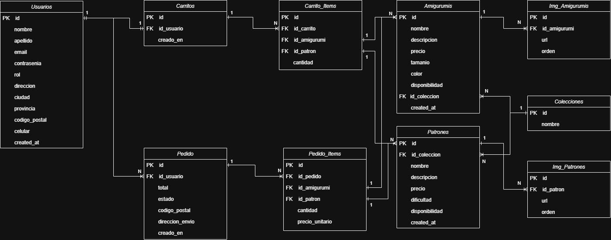

# Proyecto Final - Grupo 9 - v.0.5
## 🌟 Proyecto Final – Illumia Crochet Store
**Plataforma E-commerce Fullstack** para venta de Amigurumis y Patrones en PDF

**Illumia Crochet - Store** es una aplicación Fullstack desarrollada como proyecto final para la Tecnicatura Universitaria en Programación. Permite administrar y vender amigurumis físicos y patrones digitales, con sistema de carrito, usuarios, pedidos y panel de administración.

**[Instagram Illumia](https://www.instagram.com/illumia.crochet)**

---

## 🚀 Tecnologías Utilizadas
### Frontend

- React 18 + Vite
- React Router DOM
- Context API (manejo global del carrito, en implementación)
- Fetch API
- CSS personalizado

### Backend
- Node.js + Express
- Sequelize ORM
- MySQL
- Middlewares personalizados
- Arquitectura MVC

### Otros
- CORS
- Dotenv
- JWT para autenticación (cuando está habilitado)

---

### 🗂️ Arquitectura del Proyecto
```bash
/frontend
  /public
    /Vista-HTML-CSS (pre-fase React)
    /img
      /amigurumis
      /patrones
  /src
    /api
    /components
    /context
    /img
    /pages
    /services
    /styles
    App.jsx
    main.jsx

/backend
  /src
    /config
    /controllers
    /database
    /middlewares
    /models
    /routes
    /seeders
  server.js

```

---
## 💻 Diagrama de Flujo



---

## ⚙️ Instalación
### 📌 1. Clonar el repositorio
git clone https://github.com/ifregeiro/Proyecto-Final.git

###  📌 2. Backend

Entrar al backend:
```bash
cd backend
npm install
```

### Crear archivo .env:
```bash
DB_NAME=illumiadb
DB_USER=root
DB_PASSWORD=
DB_HOST=localhost
PORT=3000
JWT_SECRET=illumia-super-secret-key

```


### Iniciar servidor:
```bash
npm run seed
npm run dev
```

### 📌 3. Frontend
```bash
cd frontend
npm install
npm run dev
```
---


## 🛒 Funcionalidades Principales
🧸 Catálogo de Amigurumis
📄 Patrones descargables
🛒 Carrito persistente por sessionId
👤 Registro / Login
🧾 Generación de pedido
⭐ Panel de administración

```Es una versión v.0.5, todavía faltan implementar algunas funcionalidades.```

---

## 🔗 Endpoints de la API (REST)

### 📘 Amigurumis
```bash
GET /api/amigurumis
Obtener todos los amigurumis.
```
```bash
GET /api/amigurumis/:id
Obtener detalle.
```
```bash
POST /api/amigurumis
Crear nuevo amigurumi.
```
```bash
PUT /api/amigurumis/:id
Actualizar.
```

```bash
DELETE /api/amigurumis/:id
Eliminar.
```

### 📙 Patrones
```bash
GET /api/patrones
Listado de patrones.
```
```bash
GET /api/patrones/:id
Detalle del patrón.
```
```bash
POST /api/patrones
Crear patrón.
```
```bash
PUT /api/patrones/:id
Actualizar.
```
```bash
DELETE /api/patrones/:id
Eliminar.
```
### 🧺 Carrito
Trabajando en la implementación de ello.

### 📦 Pedidos
Trabajando en la implementación de ello.

### 👤 Autenticación
Trabajando en la implementación de ello.

--- 

## 🏁 Estado Actual del Proyecto
| Command | Método |
| --- | --- |
|Frontend | UI completa	✅|
|Catálogo y detalle	|✅|
|Carrito persistente	|🟡 en integración final|
|Backend CRUD completo	|✅|
|Validaciones y seguridad	|🟡|
|Deploy	|pendiente|

---

## 🌲 Ramas del repositorio

- **main** → rama principal del proyecto.  
- **ignacio** → rama personal de desarrollo de Ignacio Fregeiro.
- **gabriel** → rama personal de desarrollo de Gabriel Kessler.
- **lucia** → rama personal de desarrollo de Lucia Sola.

---

## 👨‍🎓 Participantes
- Ignacio Fregeiro
- Lucia Sola
- Gabriel Kessler

---

## Licencia

Proyecto de uso académico.  
No destinado a uso comercial sin autorización de los autores.
